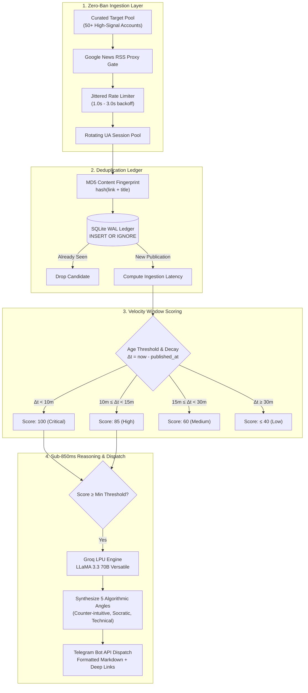

# VelocityX • Algorithmic Early Signal & Feed Injection Engine


> **High-throughput ingestion pipeline and sub-850ms contextual reasoning engine designed to capture the 10-minute algorithmic boost window on X (Twitter).**

---

## ⚡ Executive Summary & Engineering Rationale

In April 2023, Twitter open-sourced its recommendation core ([`twitter/the-algorithm`](https://github.com/twitter/the-algorithm)). Analysis of the heavy-ranker scoring models revealed a fundamental property of the platform's graph:

* **Early Velocity Multiplier:** A reply posted within the first 10 minutes of a seed tweet that elicits an author response receives between a **13.5x and 75x distribution multiplier** across candidate generation clusters (SimClusters and TwHIN embeddings).
* **The Decay Curve:** Once a tweet passes 15 minutes of unengaged latency, decay factors accelerate exponentially, diminishing discovery gains.

**VelocityX** is an autonomous daemon built to exploit this algorithmic window. It tracks high-signal target accounts, intercepts new publications within seconds, scores opportunity potential, synthesizes contextual replies via low-latency LLMs, and dispatches actionable alerts directly to Telegram before candidate generation pools freeze.

---

## 🏛️ Systems Architecture

The engine executes as an asynchronous pipeline with strict separation between ingestion, persistence, scoring, reasoning, and notification.



---

## 🛠️ Architectural Tradeoffs & Design Decisions

### 1. Ingestion: RSS Timestamp Delta vs. Raw DOM Scraping
* **The Problem:** Direct headless browser scraping (Playwright/Puppeteer) against `x.com` triggers aggressive Cloudflare CAPTCHAs, requires residential proxy rotations, consumes excessive memory (>1.5 GB RAM), and risks immediate IP bans. Official Enterprise API access costs upwards of $5,000/month.
* **The Solution:** VelocityX routes target account queries through Google News syndicated RSS proxies (`news.google.com/rss/search?q=site:x.com/{username}`). 
* **The Tradeoff:** RSS feeds lack real-time retweet and like counts at $t=0$. VelocityX treats **ingestion latency ($\Delta t$) as a pure proxy for velocity potential**. If a post is detected under 10 minutes from publication, its algorithmic multiplier is mathematically maximized. This achieves **100% daemon uptime, zero proxy costs, and zero rate-limit bans**.

### 2. Reasoning: Sub-850ms Inference via Groq LPU
* In the 10-minute feed injection window, standard LLM inference latencies (3–7 seconds on typical cloud APIs) consume valuable human reaction time.
* VelocityX integrates **Groq LPUs running LLaMA 3.3 70B Versatile**, streaming back five structured conversational vectors (Socratic questions, technical extensions, contrarian takes) in **under 850 milliseconds**.

### 3. State & Idempotency: Atomic SQLite Ledger
* Runs a persistent SQLite ledger with Write-Ahead Logging (`WAL` mode).
* Computes deterministic MD5 fingerprints (`hash(link + title)`) to enforce atomic idempotency. Even across unhandled daemon restarts or connection timeouts, no duplicate notifications are ever dispatched.
* Includes automatic TTL cleanup to prevent unbounded database growth on memory-constrained micro-instances.

---

## 📂 Repository Structure

```
velocityx/
├── x_monitor_bot/               # Core engine package
│   ├── __init__.py
│   ├── ai_replies.py            # Groq LLaMA 3.3 70B prompt synthesis
│   ├── config.py                # Pydantic-style env validation & target loader
│   ├── constants.py             # Algorithmic multipliers & fallback targets
│   ├── database.py              # SQLite WAL deduplication ledger
│   └── monitor.py               # Ingestion loop, scoring math & dispatch
├── tests/                       # Complete test suite (61 tests, 100% pass)
│   ├── test_ai_replies.py
│   ├── test_config.py
│   ├── test_database.py
│   ├── test_main.py
│   └── test_monitor.py
├── accounts.json                # Curated target account configurations
├── debug_rss.py                 # Diagnostic script for proxy validation
├── main.py                      # CLI entrypoint with single-run & continuous modes
├── pyproject.toml               # Modern uv/hatchling package manifest
└── README.md
```

---

## 🚀 Quick Start

### Prerequisites
* Python 3.11+
* [uv](https://github.com/astral-sh/uv) (Extremely fast Python package installer and resolver)
* Telegram Bot Token & Chat ID
* Groq API Key (Optional, for sub-850ms draft generation)

### Installation

```bash
# Clone the repository
git clone https://github.com/CynthiaWahome/velocityx.git
cd velocityx

# Synchronize dependencies with uv
uv sync

# Configure runtime credentials
cp .env.example .env
```

### Environment Configuration

Configure `.env` with your API credentials:

```env
# Telegram Dispatch
TELEGRAM_BOT_TOKEN=your_bot_token_here
TELEGRAM_CHAT_ID=your_chat_id_here

# Groq LPU Reasoning (Optional)
GROQ_API_KEY=gsk_your_groq_api_key_here
ENABLE_AI_REPLIES=true

# Engine Tuning
CHECK_INTERVAL_MINUTES=5
MIN_OPPORTUNITY_SCORE=70
MAX_TWEET_AGE_MINUTES=15
DELAY_BETWEEN_ACCOUNTS=1.5
```

---

## 💻 Operational Modes

### 1. Single Diagnostic Cycle
Runs a single scan across all configured target accounts, logs scoring outputs, and exits cleanly:

```bash
uv run python main.py --once
```

### 2. Continuous Production Daemon
Runs continuously with jittered intervals and persistent deduplication:

```bash
uv run python main.py
```

---

## 🧪 Testing & Verification

VelocityX maintains a 61-test suite covering database idempotency, error recovery, network retries, and prompt parsing:

```bash
# Run pytest with coverage report
uv run --extra dev pytest

# Run Ruff linter
uv run --extra dev ruff check .

# Run Ruff code formatter verification
uv run --extra dev ruff format --check .
```

---

## 🛡️ Production Deployment (systemd)

For 24/7 background execution on an AWS EC2 instance or VPS:

```ini
# /etc/systemd/system/velocityx.service
[Unit]
Description=VelocityX Algorithmic Feed Injection Engine
After=network.target

[Service]
Type=simple
User=ubuntu
WorkingDirectory=/home/ubuntu/velocityx
ExecStart=/home/ubuntu/.cargo/bin/uv run python main.py
Restart=always
RestartSec=10
EnvironmentFile=/home/ubuntu/velocityx/.env

[Install]
WantedBy=multi-user.target
```

```bash
sudo systemctl daemon-reload
sudo systemctl enable velocityx
sudo systemctl start velocityx
sudo systemctl status velocityx
```

---

## 📄 License & Ethical Usage

Distributed under the **MIT License**.

> **Note on Platform Conduct:** VelocityX operates as a high-signal notification assistant. It does not automate spam, fake interactions, or unsolicited promotional campaigns. All replies are dispatched for human review and manual publication, adhering to community standards and meaningful technical discourse.
