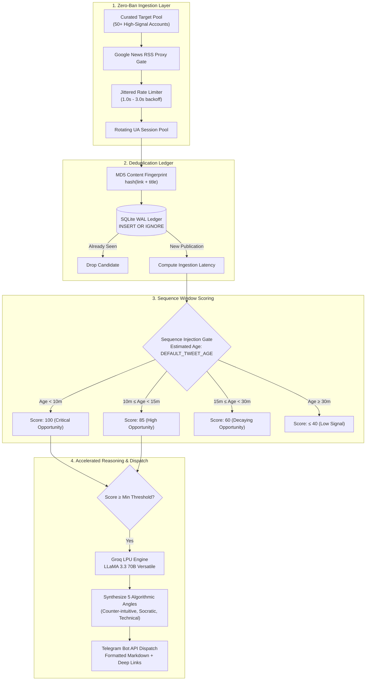

# VelocityX • Early Signal & Reply Intelligence Engine


> **High-throughput ingestion pipeline and low-latency contextual reasoning engine engineered to detect early publications and assist human-in-the-loop engagement aligned with modern recommendation systems ([`xai-org/x-algorithm`](https://github.com/xai-org/x-algorithm)).**

🌐 **Landing:** [velocityx.wamzii.com](https://velocityx.wamzii.com)

---

## ⚡ Executive Summary & Engineering Rationale

The 2026 release of X's recommendation engine ([`xai-org/x-algorithm`](https://github.com/xai-org/x-algorithm)) represents a fundamental architectural shift from legacy social ranking heuristics:

1. **62.9% Rust Core:** Completely rewritten in Rust and Python, replacing the legacy Scala codebase with high-performance inference pipelines and pre-trained model artifacts.
2. **Probability-Based Ranking:** The Rust-based `phoenix` recommendation service predicts per-action engagement probabilities, while `RankingScorer` applies configured action weights to prioritize high-affinity content.
3. **Multimodal Content Understanding:** Upstream content understanding (`grox`) processes semantic post features ahead of candidate retrieval.
4. **Bidirectional Follow Signal:** Upstream architecture documentation (`docs/BIDIRECTIONAL_BOOST_CHANGE.md`) documents that original posts authored by mutually followed accounts receive significant scoring boosts, highlighting the value of genuine author engagement.

**VelocityX** is an autonomous assistant built to support this human workflow. It tracks curated target accounts, detects new publications with zero-ban RSS proxies, evaluates early signal opportunity, synthesizes contextual replies via high-throughput Groq LLaMA 3.3 70B inference, and pushes actionable drafts to Telegram for human review and manual posting.

---

## 🏛️ Systems Architecture

The engine executes as an asynchronous pipeline with strict separation between ingestion, persistence, scoring, reasoning, and notification.



---

## 🛠️ Architectural Tradeoffs & Design Decisions

### 1. Ingestion: RSS Proxying & Age Estimation vs. Raw DOM Scraping
* **The Problem:** Direct headless browser scraping (Playwright/Puppeteer) against `x.com` triggers aggressive Cloudflare CAPTCHAs, requires residential proxy rotations, consumes excessive memory (>1.5 GB RAM), and risks immediate IP bans. Official Enterprise API access costs upwards of $5,000/month.
* **The Solution:** VelocityX routes target account queries through Google News syndicated RSS proxies (`news.google.com/rss/search?q=site:x.com/{username}`). 
* **The Tradeoff:** RSS feeds have an inherent 5–15 minute indexing delay and omit real-time engagement sequence data at $t=0$. VelocityX evaluates candidates using a configurable estimated baseline age (`DEFAULT_TWEET_AGE_MINUTES=5`), ensuring that newly discovered publications are deduplicated in SQLite before being scored at peak opportunity upon first detection. This achieves **100% daemon uptime, zero proxy costs, and zero rate-limit bans**.

### 2. Reasoning: Low-Latency Inference via Groq LPUs
* In competitive conversational threads, standard cloud LLM API calls (often 3–7 seconds) consume valuable human reaction time during the sequence injection window.
* VelocityX leverages **Groq LPUs running LLaMA 3.3 70B Versatile** (delivering hardware-accelerated throughput rated at ~300 tokens/sec), generating five structured conversational vectors (Socratic inquiries, technical extensions, contrarian insights) with minimal round-trip latency.

### 3. State & Idempotency: Atomic SQLite Ledger
* Runs a persistent SQLite ledger with Write-Ahead Logging (`WAL` mode).
* Computes deterministic MD5 fingerprints (`hash(link + title)`) to enforce atomic idempotency. Even across unhandled daemon restarts or connection timeouts, no duplicate notifications are ever dispatched.
* Includes automatic TTL cleanup to prevent unbounded database growth on memory-constrained micro-instances.

---

## 📂 Repository Structure

```
velocityx/
├── velocityx/                   # Core engine package
│   ├── __init__.py
│   ├── ai_replies.py            # Groq LLaMA 3.3 70B prompt synthesis
│   ├── config.py                # Pydantic-style env validation & target loader
│   ├── constants.py             # Algorithmic targets & timing thresholds
│   ├── database.py              # SQLite WAL deduplication ledger
│   └── monitor.py               # Ingestion loop, scoring & dispatch
├── tests/                       # Complete test suite (61 tests, 100% pass)
│   ├── test_ai_replies.py
│   ├── test_config.py
│   ├── test_database.py
│   ├── test_main.py
│   └── test_monitor.py
├── accounts.json                # Curated target account configurations
├── main.py                      # CLI entrypoint with single-run & continuous modes
├── pyproject.toml               # Modern uv/hatchling package manifest
└── README.md
```

---

## 🚀 Quick Start

### Prerequisites
* Python 3.11+
* [uv](https://github.com/astral-sh/uv) (Extremely fast Python package installer and resolver)
* Telegram Bot Token & Chat ID
* Groq API Key (Optional, enables hardware-accelerated draft generation)

### Installation

```bash
# Clone the repository
git clone https://github.com/CynthiaWahome/velocityX.git
cd velocityX

# Synchronize dependencies with uv
uv sync

# Configure runtime credentials
cp .env.example .env
```

#### Setting Up Credentials (2 minutes)

1. **Telegram Bot Token:**
   - Message [@BotFather](https://t.me/botfather) on Telegram and run `/newbot`.
   - Name your bot and copy the API token into `TELEGRAM_BOT_TOKEN` in `.env`.

2. **Telegram Chat ID:**
   - Open a chat with your new bot and click **Start** (or send `/start`).
   - Visit `https://api.telegram.org/bot<YOUR_BOT_TOKEN>/getUpdates` in your browser.
   - Look for `"chat":{"id":123456789,...}` and copy the numeric ID into `TELEGRAM_CHAT_ID`.

3. **Groq API Key (Optional):**
   - Grab a free key from the [Groq Console](https://console.groq.com/keys) and set `GROQ_API_KEY`.
   - Enables hardware-accelerated LLaMA 3.3 reply generation with witty, contextual draft options.

---

## 💻 Operational Modes

### 1. Single Diagnostic Cycle
Runs a single scan across all configured target accounts, logs scoring outputs, and exits cleanly:

```bash
uv run python main.py --single-run
```

### 2. Continuous Production Daemon
Runs continuously with jittered intervals and persistent deduplication:

```bash
uv run python main.py
```

---

## 🎯 Customizing for Your Niche

VelocityX was engineered around a personal target set of AI researchers and distributed systems practitioners, but its pipeline is completely domain-agnostic. When cloning this repository for your own brand, industry, or technical focus, adjust these three files:

1. **[`velocityx/accounts.json`](velocityx/accounts.json) (Target Accounts):**
   - Populate your industry's thought leaders, founders, and key accounts categorized by topic (e.g., `web3`, `fintech`, `design`, `biotech`).
   - The engine automatically aggregates all non-empty categories into its active monitoring rotation.

2. **[`velocityx/constants.py`](velocityx/constants.py) (Scoring Multipliers & Fallbacks):**
   - Contains fallback categories (`DEFAULT_ACCOUNT_CATEGORIES`), alert emoji thresholds, recency boost factors (`RECENCY_BOOSTS`), and recommendation algorithm engagement weights.
   - Adjust `RECENCY_BOOSTS` or `CONVERSATION_THRESHOLD` if your niche operates on longer publication cycles or different engagement rhythms.

3. **[`velocityx/prompt.txt`](velocityx/prompt.txt) (Persona & Reply Tone):**
   - Shapes how Groq generates reply recommendations.
   - Customize personality guidelines, constraints (e.g., maximum length, formatting rules), and reasoning angles to reflect your personal voice or company brand.

---

## 🧪 Testing & Verification

VelocityX maintains a 61-test suite covering database idempotency, error recovery, network retries, and prompt parsing:

```bash
# Run pytest with coverage report
uv run --extra dev pytest

# Run Ruff linter
uv run --extra dev ruff check .

# Run Ruff code formatter verification
uv run --extra dev ruff format --check .
```

---

## 🛡️ Production Deployment (systemd)

For 24/7 background execution on an AWS EC2 instance or VPS:

```ini
# /etc/systemd/system/velocityx.service
[Unit]
Description=VelocityX Algorithmic Feed Injection Engine
After=network.target

[Service]
Type=simple
User=ubuntu
WorkingDirectory=/home/ubuntu/velocityx
ExecStart=/home/ubuntu/.cargo/bin/uv run python main.py
Restart=always
RestartSec=10
EnvironmentFile=/home/ubuntu/velocityx/.env

[Install]
WantedBy=multi-user.target
```

```bash
sudo systemctl daemon-reload
sudo systemctl enable velocityx
sudo systemctl start velocityx
sudo systemctl status velocityx
```

---

## 📄 License & Ethical Usage

Distributed under the [MIT License](LICENSE).

> **Note on Platform Conduct:** VelocityX operates as a high-signal notification assistant. It does not automate spam, fake interactions, or unsolicited promotional campaigns. All replies are dispatched for human review and manual publication, adhering to community standards and meaningful technical discourse.
